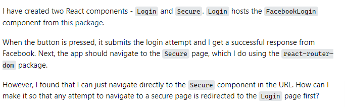
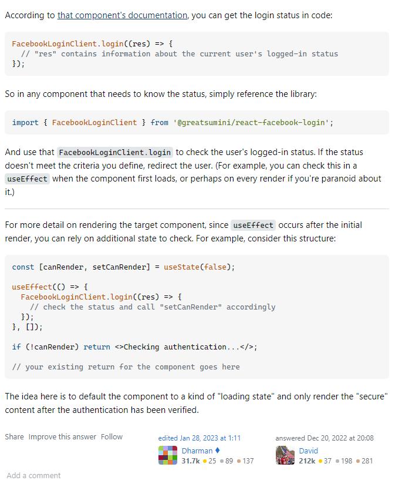

## What is a smart question
A big skill to learn as a software engineer is how to ask a question. Not just any question but a “smart question”.  But what is a smart question, and why is it a big skill to learn? From [“How to ask Questions The Smart Way”](http://www.catb.org/esr/faqs/smart-questions.html#idm696) by Eric Raymond has a good guide on how to ask smart questions. Some of the important points are, to make a good header, one that is about your problem and the specific parts/system you need help on. Give as much information as possible about the problem, what is wrong, what system or environment you are working on, what you are trying to receive and what steps have you tried in fixing the problem before asking. 

## Why a Smart Question is important
The reason you want to propose your questions like this is to make it easier for people to respond and give out a good answer to your questions.With a good header, this will help with people with the same type of problem trying to look up a solution. It is also easier for people with the information to find your question in the sea of other questions and answer it. Giving good information, mainly about the problem, makes it so others can see exactly what kind of problem you are trying to solve, and what to recommend or do to solve it. Maybe you need to do x but can’t do y because of some reason. If you clearly state that, when others are answering, they know to avoid using y. 

## An example of a Smart Question:
[https://stackoverflow.com/questions/74868311/how-can-i-secure-a-component-in-reactjs](https://stackoverflow.com/questions/74868311/how-can-i-secure-a-component-in-reactjs)

## Response of the Smart Question:

## The Post Summary:

This post is asking about how they can secure a component in reactjs. In it they are asking about how they have created a way to login using a Facebooklogin package with them linking to the package. That there function using a certain package to get what they want. They want to find a way that people accessing a secure page are redirected to the login part first.
This prompted an answer of someone going through the documentation of the package, and showing the code of a command that can help with the task, as well as a way to gain the status. And what to do for what to do when the login status is not correct.

## Why is it a Smart Question

The reason I think that it is a smart question is that, in their response they started with what their question is about (ReactJs), and started with a brief explanation of what they have, also giving a link to a package that is used for this. Then explains a part of the code they have and then asks a question about how to build something based off of the code they have. This gives enough information, with telling what they are doing it on, with the link to the package and how they gave explanation on what they are doing and asking what they need after. In certain situations, providing code for this will make it easier to see what's being done, this question doesn’t seem to need that. The response given to this question is a helpful response to the given question. The response gives the questioner code for the problem they have and explanation on how to use the code for their problem, with the explanation on the login command.

## It might not work all the time.

One thing to know is that, even if you are to ask a smart question, it is not always going to lead to a smart answer or the answer you are looking for. Most likely, you are asking other humans in a forum. This means that it can take a while for people to respond to your questions, maybe they don’t answer the questions the way you wanted/needed to, or they gave you a vague response, or they were just rude. It will happen as you are interacting with humans, but it would likely have a response like this if it wasn’t a smart question. It's just the reason to use a smart question is to reduce the chances of this happening and to get a better chance at getting your questions answered.

