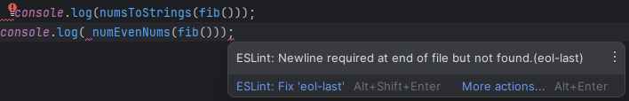

## What is Coding Standards?

Coding standards, in which you have a system of how you are to write your code, i.e. how many spaces, indentation or how you close a line. If you are to hold up to a coding standard you are expected to do the same little details all the way through your code. This creates a consistent and “clear” way for people and you later to read your code. I see this as an important skill in general to a certain degree. Coding standards will help make your code more visible for others, and is great for when working with others, as well as yourself because then you can make certain ways to structure your code to not get confused about it. I think it is best to come up with your own coding standards that helps you organize your code, while giving you more flexibility to what you do.
 

## ESLint, love and hate it:
I am trying coding with a pre-established coding standard which is ESLint. Doing this is just really annoying. It’s way too stingy on the things you need to do. Space after a {, ( but not before, how much space you can make, you can’t indent here. It is just more annoying than anything, just having to do this small thing. It's both a blessing and a curse. Making my code look more consistent and cleaner to a certain extent, at the cost of expression and my own personal frustration dealing with fixing the problems ESLint has with my code. Just the little things that you don’t notice, it just shows error signs. Would I recommend ESLint, Maybe. I can see it being helpful if you need help organizing your code, but if you already know it and can do it your own way, just do that and save yourself the time needed to fix the small things that ESLint points out.

## ESLint Example of problems:

In this example it's showing that you're not supposed to have a random line just tabbed, no space before the bracket, as well as needing to have an empty line at the end of the file.

## Final Thoughts:
Even If I think that it's an annoying thing to do, I'm still keeping to ESLint until I can get a common rhythm of typing to the coding standard so that later on I can make my own standard for myself that is visually readable. Because right now without it, sometimes my code might look a little weird, but ESLint is showing me to type it cleaner more constantly. Hopefully I can have this skill developed as many of the jobs I can go for will be with other people sharing the code constantly and if I can’t have easily readable code for others, it's going to be a problem for me to explain it. 

