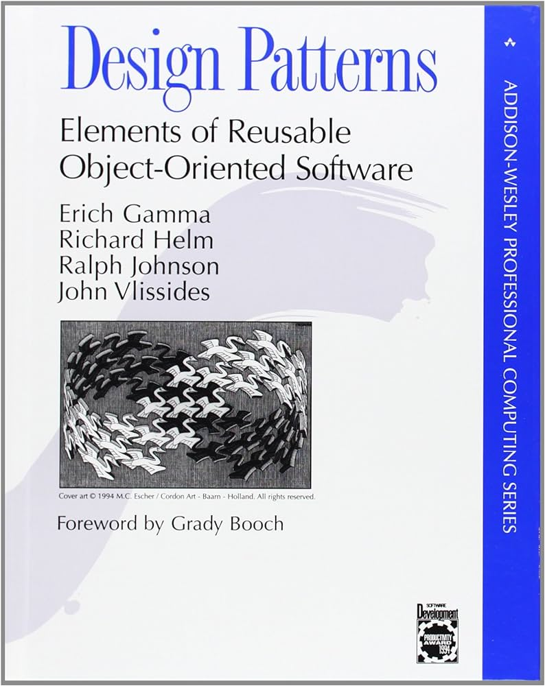
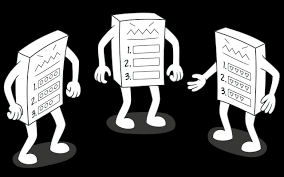

## Solving the Same thing Over and Over again

The more you get further into coding and software development, the more tedious and annoying it gets when you have to type the same thing for different problems. Many times it's going to be the same problem that you have
to type and do again. Until you just realize that you could shortcut this and make just general solutions to solve things and just fill in the things needed for each case. Do it once generally and make it way more easier 
for you later. A great thing to use, Makes it easier for you to use again for similar problems, easier to find problems too and keeps things more organized with many of the things having similar structure. Also a good idea for when people look at your code, for them to have an idea of how your things work.

## The Shortcut to it all, or Blueprint

What is this called you may ask? Design Patterns. A name created in a book called “Design Patterns” by the Gang of Four(GoF). Reiterating from above, It's about creating patterns, by using objects and classes to solve a set of problems in certain scenarios. Usually its going to be dealing with Creation, Structure, Behavioral. With Creation focusing on the creation of objects and how the creation is going to be handled. Something like cloning an object already made (Prototype method), or making creation more abstract while making its subclasses objects needed (Factory Method). Structure is the focus on the structure, or bigger picture to use objects and classes to make it better. Where you are making a way for two classes, interface, objects interact when they normally can’t (Adapter Method), Using similar states of multiple classes or objects shared to save space(Flyweight Method). And behavioral focusing on how the classes, objects, interfaces interact with each other. You can create a super class that has all these rules and all, and have the subclasses override certain spots separately(Template Method). 

## Conclusion

All these strategies come down to build one big thing to solve multiple problems at once. A shortcut to say. It's a nice thing to use, or else I would lose my mind typing similar things over and over again then getting confused on one part and finding out everything else with that same problem. Saves me a headache. 
