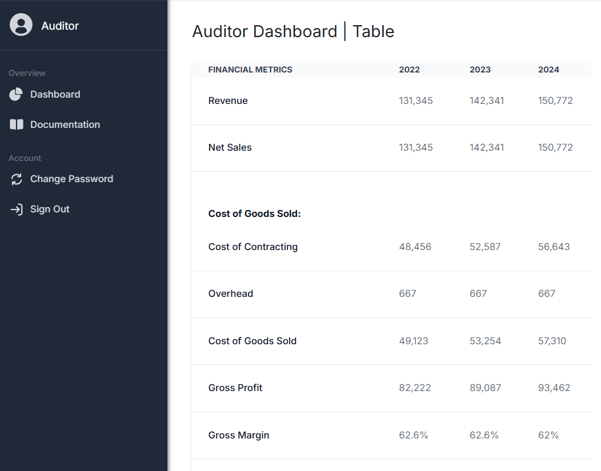

## A First Time:
During the Spring Semester of 2025 I was given the chance of working on a project for one of my classes to create and develop a prototype website for a company called Spire Hawaii. For this project we were randomly assigned into different teams to work on an example of their excel sheet and turn it into a  website with ease of access and being able to do changes on the spot and show it in real time. It was a great privilege to be able to work on something like this. For one it gives me a small introduction on what I will be doing in the future of my career working with others to make something for a customer.
 

## The Team and Project:
My group was called TeamUsa2025. The people there were great who In my opinion knew way more than what I knew which was a good thing being able to ask for their opinion and help on certain things. My main part that I worked on this project was making the Auditor Table show and display the information given and be able to edit the data for the database. Just creating the table was a hassle trying to learn how to connect a database to the table used in javascript/tailwind. Working with the whole database was something new to me as this was the first time working on it.

## Presenting to a Customer:
It is the first time working on something for someone else that wasn’t just an assignment. And seeing the people give us feedback and talk about what you have done, and request to everyone was interesting. Also presenting it to a live reaction to the things was also a new thing for me and was very nervous on how they look at our project. But they were very kind with what they had to say and gave us plenty of information needed to make the project.

## Final Thoughts:
In general this whole project was a great way to see what's to come in the computer science field. I do hope to get to go more into this field after this. Seeing the Customer see what we created was the best feeling, and having others to fall back on is a nice feeling. Although I wished I could have been better, given some experience hopefully I won't be a complete fish out of water and be able to give good feedback and things to the project more next time.

## The Project:
https://teamusa2025.github.io/
