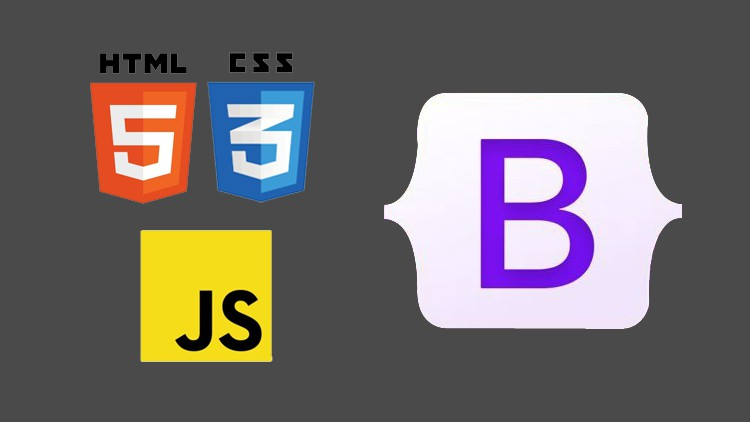
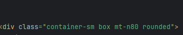
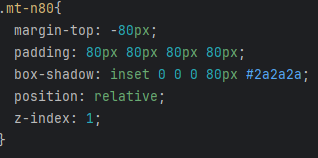

## HTML What is it?

HTML, a programming language used to create many of the pages you see on the Internet today. With CSS there to help stylyze the website you create. It’s easy to pick up on the basics, but once you try to do something a little complicated it gets really confusing. Especially when trying to style it to make it not look like an early 2000’s website. Mainly things like adding text on an image, making interactive buttons on the screen. It all requires a mix and match of things combined to make it nice. It can get very time consuming trying to figure out how to style things in a certain way.

## Framework for more.

But if you want to have a more interactive system for your website and don’t want to code it yourself, you can use a framework UI. The one I used was Bootstrap. A Framework Ui that is commonly used among many websites. It mainly has a lot of layout options to use to make your website. Things like Containers, Rows, Cards, Buttons, Dropdowns, Interactive items. It gives us immediate options to make your website, but it still is bogged down by how complicated it is. Just like HTML there are many different styling options you have access to but still have to do some specific things for small specific designs you want to create. 

## Example

Here I wanted to emulate the box here on this website where the box partially goes over the image. The way I had to do it was to style it so that the image was in a certain index, make the box margin into the negative to move into the image partially and then had to use a shadow to color the outside.

## What I implemented:

## The first part of this:

## The style needed to acheive the effect:

## Opinions of Bootstrap and HTML 

This may seem like it's not very useful and to just use HTML. But having these already created classes to make these designs for me is very helpful when you have little HTML knowledge. It's basically just trying to format it based on the certain rules with a bunch of pre-made classes rather than creating Everything by yourself. I can see it being more time consuming just using HTML. But it is very aggravating trying to use these to recreate something.
