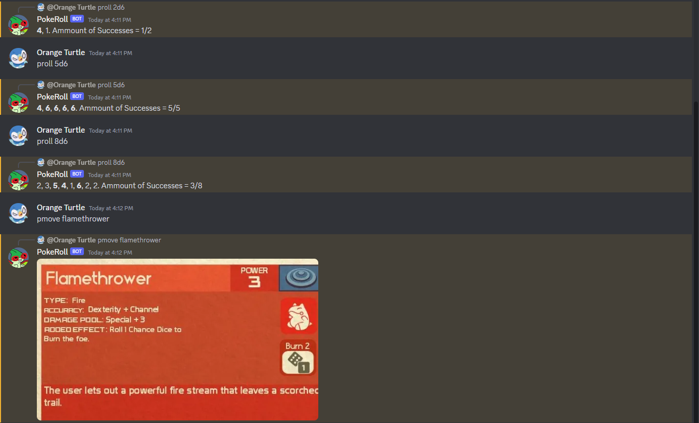

Pokeroll is a discord bot created to help users playing the tabletop game [PokeRole](https://www.pokeroleproject.com/). It is both a dice roller, and a way for users to search for a specific move that they are looking for. 
This was a solo project that I did to both help test my skills and to make something for my friends. It mainly helped in gaining the basics back for me.

This is an example of the bot in work:

<pre>
----------------

---------------
</pre>

Source: <a href="https://github.com/JavinSol/pokerollBot"><i class="large github icon "></i>JavinSol/pokeroll</a>
