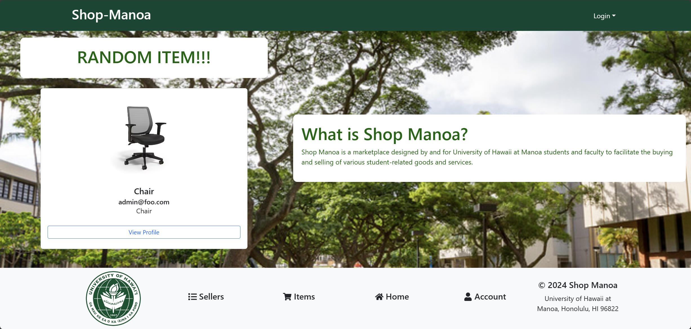

Shop Manoa is a project created to help students at the University of Hawaii Manoa Campus to sell their objects, things or services on campus with other students. This marketplace is similar to marketplaces like Craigslist, Ebay, or Facebook Marketplace but located only in UHM. 

## The Overview shown on our github page:
The project, tentatively named “Shop-Manoa”, aims to address the rapid turnover of goods and services among students at the University of Hawaii at Manoa (UHM). The primary goal is to create an effective marketplace for campus-specific items, facilitating their recycling and reuse.
Shop-Manoa allows UHM students, faculty, and staff to buy and sell student-related goods and services. This platform is similar to Craigslist, with key differences including the requirement for UH credentials for all users, no anonymity, and the expectation of on-campus transactions.

## Contributions to the project
This project was for the class ICS314, where we had to develop a website that is to help solve a problem for Uhm. Within this group my work was focused on creating the categories page, and when you are on each page, that the items shown up are apart of the category you clicked. 

The creation of the Categories page came with some troubles of figuring out how to use Meteor’s database to gain information to actually split the listings to each category. 

But through the work of this project, a big thing I learned was about designing and creating a website using Meteor, MonoDB, EsLint. As well as working as a group with others on a project using Issue driven Project Management. Where we are to work on small issues slowly and build up main focusing on these small issues. 

This project was an early show of what I am to expect and what is to come in this route I choose. 
As this is the first Computer Science type project that isn’t solo or just with one partner, as well as focus on creating something new rather than just following some instructions that a teacher gave me, I will focus and work to improve the flaws that I had when working with others.

[Check out our project here](https://shop-manoa.github.io)
  
[If the site still works here](https://shop-manoa.com)

I want to thank my group for working very hard on this project.
