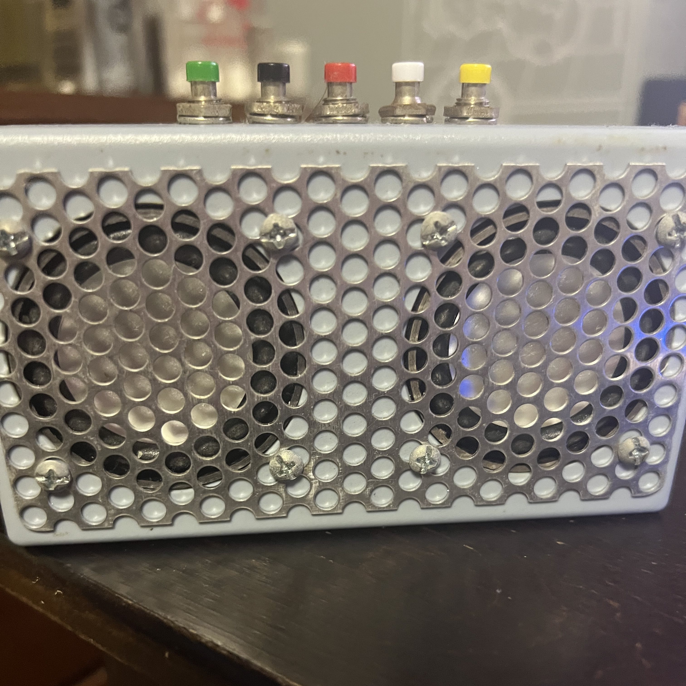
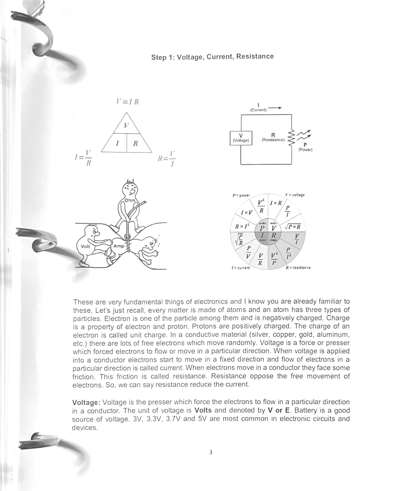

During Honolulu Community College Engineering Academy, we created a bluetooth speaker, using the knowledge of circuits, and Soldering, we created a small speaker with the capability of bluetooth. This and other projects were done at this Summer Academy where we were taught skills regarding Electrical Engineering, Like Soldering, 3d Printing/CAD, and use of the Multimeter tool.

A page from the worksheet given:

